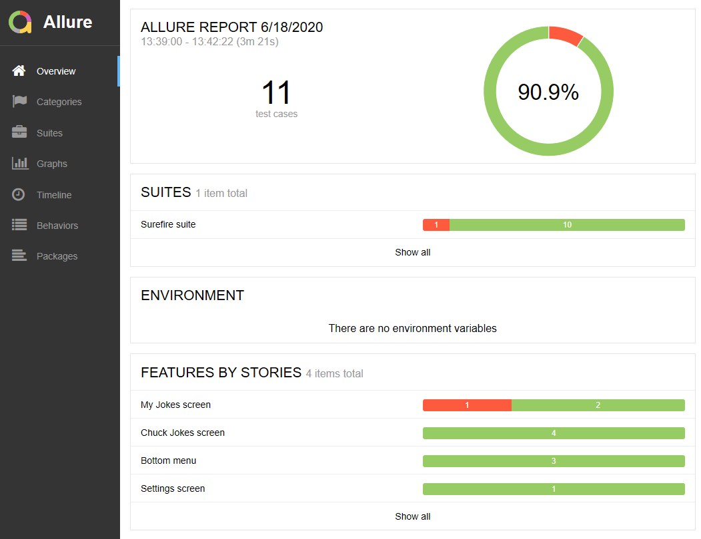

## About
This is Android automation test project, which is based on Java + Maven + TestNG + Selenide + Appium + Allure

## Preconditions
in order to run you'll need:

- maven 3.6

- appium server

- avd

- java 8+

Appium should be installed via npm by running

`npm install -g appium`

If you have appium already installed w/o npm, probably you'll need to launch appium server manually.

If this is the case - please set `manual.launch` to `true` in src/main/resources/application.properties

Android virtual device should be created manually, set its name to `avd.device.name` property in `src/main/resources/application.properties`

For automatic launch path to android emulator must be set to `avd.emulator.path` property

### How-to-run
If `manual.launch` is set to `false` :

just launch tests by executing CLI command

`mvn clean test allure:serve`

If `manual.launch` is set to `true` :

Start AVD and Appium server manually, then execute 

`mvn clean test allure:serve`

## Report

After test run is finished, report will be open automatically

Report will contain detailed info and screenshots of the virtual device, if test is set to 'failed'

Examples:

If for some reason report did not open automatically, you may generate report manually by 
executing `mvn allure:report`, then report can be found in target/site/allure-maven-plugin/index.html , 
although it should be noted that some browsers struggle to display it properly due to security policies.